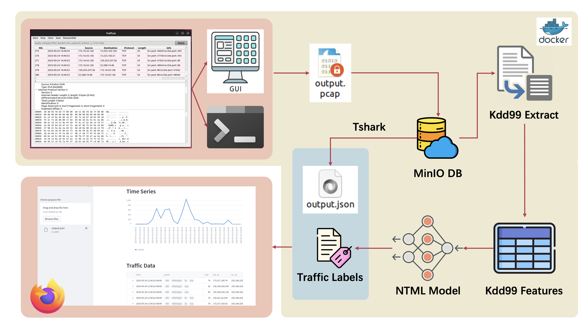

TrafficCat
=====

Machine Learning Based Network Traffic Analysis and Audit System



Dependencies
-----
```bash
$> sudo apt install build-essential
$> sudo apt install qtbase5-dev qtchooser qt5-qmake qtbase5-dev-tools
$> sudo apt install libpcap-dev
$> sudo apt install tshark
$> pip install streamlit
$> pip install pandas
$> pip install scikit-learn
$> pip install torch
```

Sniffer: Run with GUI
-----
```bash
$> cd build
$> chmod +x ./build.sh
$> ./build.sh
$> ./bin/trafficat
```

Sniffer: Run with CLI
-----
```bash
$> cd build
$> chmod +x ./clsniff.sh
$> ./clsniff.sh
$> ./bin/clsniff
```

Pcap to json
-----
```bash
$> tshark -r data/traffic.pcap -T json > data/traffic.json
```

Run kdd99extractor and analysis
-----
```bash
$> sudo kdd/kdd99extractor data/traffic.pcap > data/extractor.txt
$> python3 kdd/inference/main.py
```

Run streamlit Page
-----
```bash
$> streamlit run web/dashboard.py
```

Run the entire system in command line
-----
Capture traffic and display it immediately
```bash
$> cd build
$> chmod +x ./clsniff.sh ../run.sh ../all.sh
$> ./clsniff.sh
$> cd ..
$> sudo ./build/bin/clsniff
$> ./run.sh
```
Analyse all historic traffic(need to have run the above process at least once)
```bash
$> ./all.sh
```
